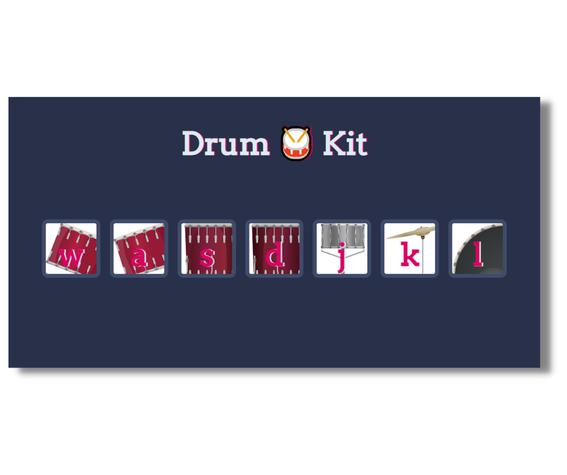

# Drum Kit

This drum kit web is a web application that simulates the sounds of a drum kit. These apps are designed to provide users with a realistic and customizable drumming experience.

### Links

- Live Site URL: [https://drumkit-pperdana.netlify.app](https://drumkit-pperdana.netlify.app)

## Table of contents
  - [Overview](#overview)
    - [Features](#features)
    - [Screenshot](#screenshot)
  - [Tech stack](#tech-stack)
  - [Author](#author)
  

## Overview

### Features

- Virtual drum kit with multiple drum
- Customize drum kit and sounds
- Play drums using keyboard keys

### Screenshot

## Tech stack

- Semantic HTML5 markup
- CSS Custom Properties
- Vanila Javascript
- Javascript DOM
- Mobile First Workflow

## Author

- Website - [pperdana.netlify.app](https://pperdana.netlify.app)
- Frontend Mentor - [@Panji200](https://www.frontendmentor.io/profile/Panji200)
- Email - panjiperdana088@gmail.com
